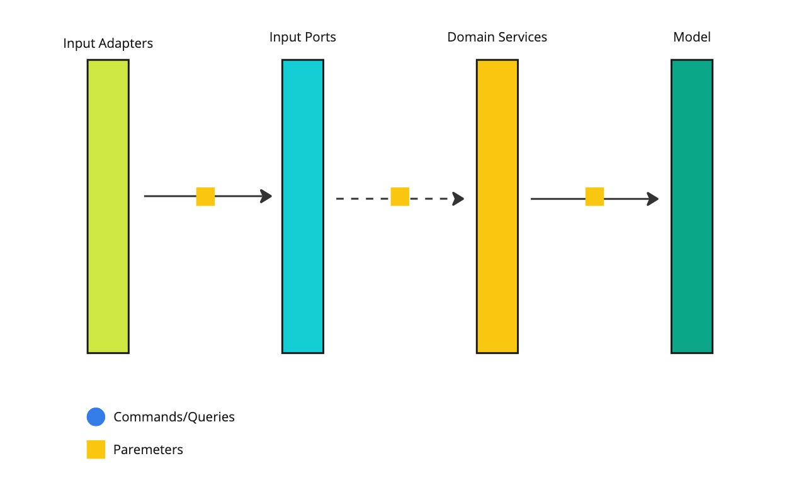
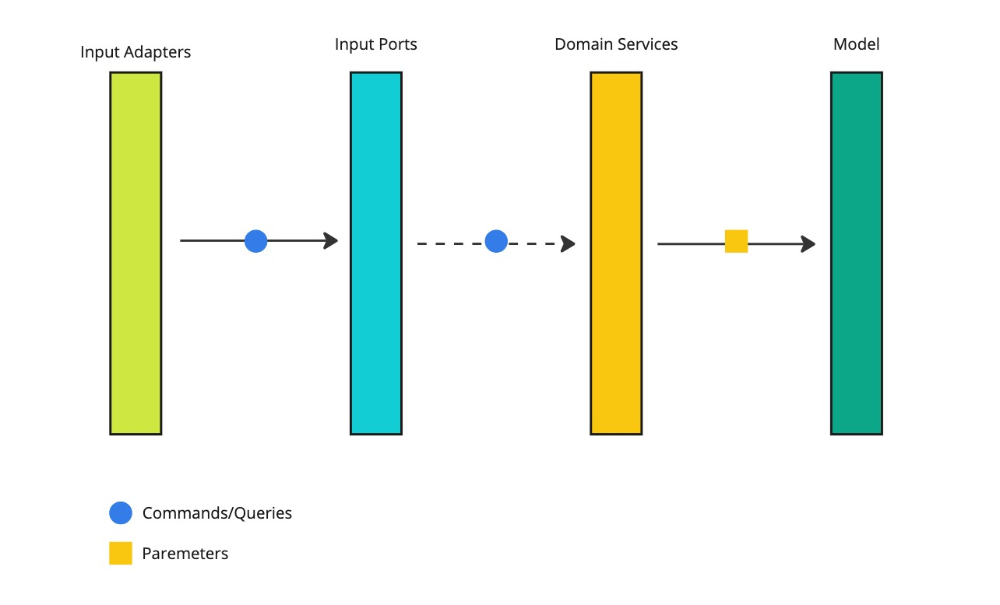
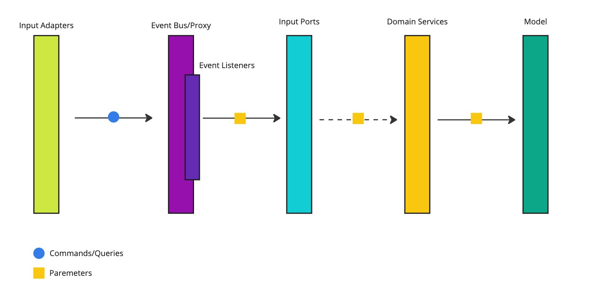

# [ADR-3] Input Ports Should Accept Only Value Objects From the Model Instead of Commands and Queries

## Context

*Input Ports* are the gates to the *Domain Services* and the model. The way they're shaped influences how easy, or not,
it's
to the *Domain Services*. Moreover, they also influence how the other *Domain Services* are implemented.

The root of this ADR lays in the following situation:

> You implement a *Domain Service*. You want to retrieve a user that performs an action. Would you call *Output Port* or
*User
> Domain Service*?

My answer to this question was that I should call the *Domain Service*. It knows which port and how it should be called.
It also knows how to mount the user's object so that it's ready to be used in different parts of the domain.

It turned out that *Domain Services* (that implement *Input Ports*) should be easy to call by both *Input Adapters* and
other
*Domain Services*.

## Options

### Input Ports Accept Raw Parameters (Value Objects and Primitive Types)

With this approach *Input Ports* accept value objects and primitive types as parameters. The concept of commands and
queries
is not introduced at all.

Pros:

* the number of layers is limited
* the raw parameters are exposed
* *Input Ports* are easier to be called from other *Domain Services* as input parameters are extractable from models

Cons:

* additional effort is required to separate reads from writes
* the above separation is extracted to the higher level - from commands and queries to separate *Input Ports*
    * this implies that the granularity of *Input Ports* will be smaller - more *Input Ports*

### Input Ports Accept Commands and Queries

In this solution, *Input Ports* defines both commands and queries and knows how to act upon receiving them.

Pros:

* there is a clear separation of commands from queries
* the interface is more descriptive

Cons:

* when an *Input Port* is called from inside the domain (another *Domain Service*), the creation of a command/query
  object is required

### Input Adapters Push Commands and Queries to an Event Bus/Proxy

The third option introduces the concept of an *Event Bus* (or a Proxy layer alternatively) that translates commands and
queries
into parameters accepted by an *Input Port*.

Pros:

* the way the *Input Adapters* call *Input Ports* will be separated from the way the *Domain Services* call themselves
* the *Domain Services* will be able to call themselves using raw parameters

Cons:

* there is an additional layer that increases the complexity of the whole solution
* there is no technical need for introducing an *Event Bus*
    * no asynchronous processing is needed yet
    * the full potential of the *Event Bus* won't be utilized
    * the thin proxy complex will fit the architecture better
* for each command and query a separate listener will be required

## Decision

Considering:

* the pros and cons of each solution,
* willingness to achieve the tailored architecture,
* current architectural drivers,
* my capacity,
* lack of the domain's stability

I decided to progress with
the [Input Ports Accept Raw Parameters (Value Objects and Primitive Types)](#input-ports-accept-raw-parameters-value-objects-and-primitive-types).

The ease of calling an *Input Port* from inside the domain was one of the main factors. From my experience playing with
many small objects (commands and queries) looks great from the typing and interface reading perspectives. However,
building these objects
in other *Domain Services* highly reduces the code's readability.

There is also no need for introducing another layers (either *Event Bus* or *Proxy*) that will just translate commands
and queries
to raw parameters. Every new layer requires to be tested. When refactoring commands/queries or Input Ports parameters,
two more times
tests will be refactored.

By having a high granularity of *Input Ports* it would be easy to refactor any of them to one of the other considered
options.
The *Event Bus* or *Proxy* concept will be introduced only in the places that actually need them.

## Consequences

1. [[ADR-2 ] Input Port Commands and Queries Should Accept Only Value Objects From the Model](2-commands-queries-no-models.md)
   will be true but for *Input Port* methods parameters.
2. All the Input Ports will be refactored. The commands and queries will be removed.
3. The separation between reads and writes will be extracted to the *Use Case (Input Port)* level.
