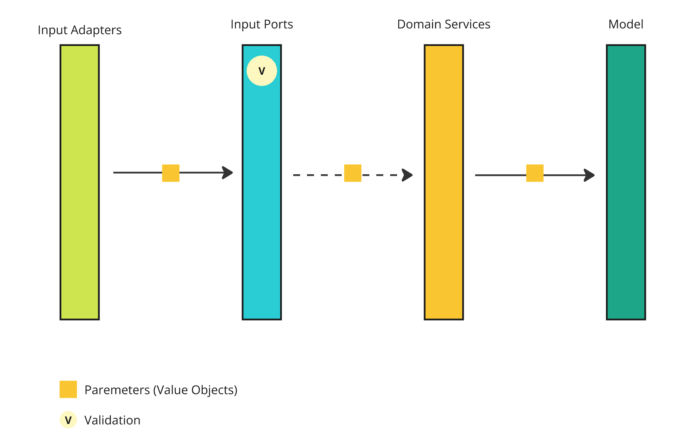

# Input Data Validation

## Context

There are a number of validations in the system to be performed. The format of email should be checked. The
extension of a file should be verified. The length of a description should also be validated.

There should be a unified approach to validation. The system should ensure that as much verification is performed
as possible. The application should also report validation errors in a unified way.

## Options

### Validation at the adapter level


The input data is verified as soon as it reaches the application. The input adapter level components validate it.
Later validation is not required as the data passed to downstream components is already checked.

Pros:

* the domain doesn't need to handle the validation, it can focus on business logic.

Cons:

* the domain has to *believe* that the adapter validated the data,
* validation within adapters might be inconsistent,
* validation logic might be duplicated
  * it will be tested multiple times within different components.

### Validation at the port level



The validation is performed at the ports level. An input port that receives any data is responsible for
any required validation. Moreover, data validation is transparent to any other layer than ports.
Validation errors are returned as a `Try<>` result.

Pros:

* any business-important validation logic is encapsulated within the service,
* the adapter level components don't need to bother with any validation.

Cons:

* a service is messed with validation that might not always be business critical,
* it is possible to create invalid Value Objects,
* validation logic might be duplicated
  * it will be tested multiple times within different components.

### Validation during Value Object creation


Any validation logic is encapsulated into Aggregate/Value Object class.
Neither ports nor adapters perform validation.

Pros:

* it's impossible to create an invalid object,
    * object in an improper state might be used outside the model,
* there is no single layer that performs the validation,
* validation is local to the object,
* when validation rules change, there is only one place to update
  * it's tested once.

Cons:

* object creation will throw validation errors,
* validation error handling is performed by the clients code (e.g. REST controller),
* all input parameters will need to be transformed to data objects.

A [POC](https://github.com/mateuszbrycki/bookkeeper/commit/4698b0f3bc4391f74500c6f27b3b79196ffbd45c) of such an approach
have been prepared.

## Decision

Data validation should be performed when creating a Value Object.
It should be impossible to create an object with invalid data.
Neither adapters nor ports should perform any values validation.

Any Value Object has:

1. private constructors,
2. a factory method:

```java
public static Validation<Errors, T> of(...params) {
  ...
} 
```

## Consequences

1. All input parameters should be refactored to Value Objects.
2. Adapters should have validation error handling.
3. A common type for validation errors should be introduced.
4. An architecture test that validates the decision from this ADR should be implemented.
